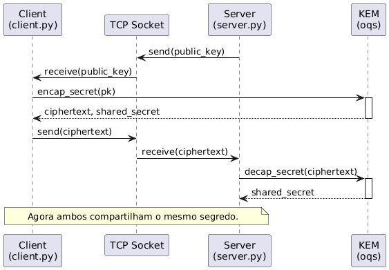
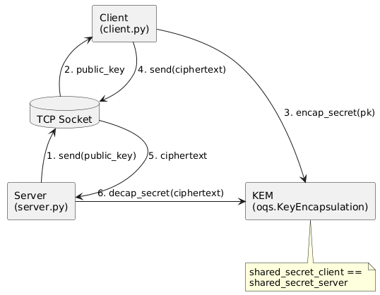

# 🛡️ Post-Quantum Key Exchange with CRYSTALS-Kyber (Kyber-768)

This project implements a **secure post-quantum key exchange protocol** based on the **CRYSTALS-Kyber (Kyber-768)** KEM scheme, using the **Open Quantum Safe (liboqs)** library.
It shows how a **client** and a **server** can establish a secure shared secret even in the presence of an attacker intercepting communications.

---

## 📌 Project objectives

- Implement a **post-quantum** key exchange with Kyber-768
- Create **client-server** communication in Python
- Generate and exchange a **ciphertext**
- Demonstrate that both parties obtain the **same shared secret**
- Provide **evidence** of operation (logs, screenshots)

---

## 🧩 System architecture

### Server

- Generates a Kyber-768 key pair
- Sends its **public key** to the client
- Receives the **ciphertext**
- Decrypts to retrieve the **shared secret**

### Client

- Receives the server's public key
- Encapsulates a secret → produces a **ciphertext**
- Sends this ciphertext to the server
- Obtains its **shared secret** locally

### Expected result

The two values must be **identical**:
shared_secret_client == shared_secret_server

The ciphertext should be approximately **1088 bytes** (typical size for Kyber-768).

---

## 🚀 Project execution

### 1️⃣ Install dependencies

Install the Python version of liboqs:

```bash
pip install git+https://github.com/open-quantum-safe/liboqs-python.git
```

### 2️⃣ Launch the server

In a first terminal:

```
python3 server.py
```

### 3️⃣ Launch the client

In a second terminal:

```
python3 client.py
```

## Authors

- Nicolas Magne
- Jessica Devulder
- Tainá Da Cruz

---

## 📷 Diagrams

The repository contains two diagram images illustrating the protocol flow and the component relationships. They are included in the project root as `diagrama_de_sequencia.png` and `UML.png`.

### Sequence diagram



Explanation (English):

- The `Server` generates a Kyber key pair and sends its `public_key` to the `Client` via the TCP socket.
- The `Client` receives the `public_key` and calls `encap_secret(pk)` on the KEM (liboqs). The KEM returns a `ciphertext` and the client's `shared_secret`.
- The `Client` sends the `ciphertext` back to the `Server` over the socket.
- The `Server` calls `decap_secret(ciphertext)` on the KEM using its secret key and recovers the same `shared_secret`.

This diagram highlights the chronological message flow and the fact that both parties derive the same shared secret.

---

### Component / UML diagram



Explanation (English):

- The UML diagram shows the main components: `Server` (`server.py`), `TCP Socket`, `Client` (`client.py`) and the `KEM` (`oqs.KeyEncapsulation`).
- Numbered steps indicate the flow: (1) server sends `public_key` → (2) client receives it → (3) client encapsulates using the KEM → (4) client sends `ciphertext` → (5) server receives ciphertext → (6) server decapsulates and obtains the shared secret.
- The important security point: the KEM operations ensure `shared_secret_client == shared_secret_server` while only the `public_key` and `ciphertext` transit over the network.

If you want, I can also embed the images as clickable thumbnails, or generate and commit PNGs from PlantUML source if you prefer the source-first workflow.
